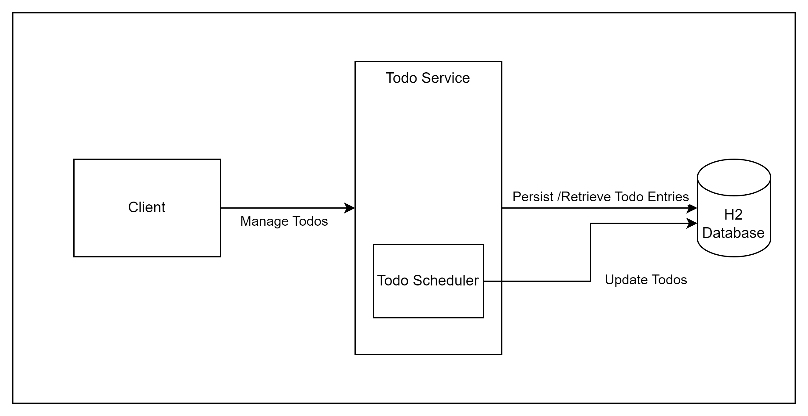

# Todo Service
Simple service for managing todo items

# Simple Design
  
* Provides REST endpoints for creating and managing todo items.
* Automatically marks items that are past their due date as "past due"

# Technology Stack
Few key language and frameworks
* Java 17
* Springboot
* H2 DB

# Local : Build and Run
* With Java
  * **Prerequisite** : [Install JDK 17](https://access.redhat.com/documentation/en-us/openjdk/17)
  * **Build** :  `./mvnw clean install`
  * **Run** : `java -jar target\todo-service-0.0.1-SNAPSHOT.jar`
* With Docker
  * **Prerequisite** : [Install Docker](https://docs.docker.com/engine/install)
  * **Build** :  ` docker run todo-service`
  * **Run** : `docker run -p 8080:8080 todo-service`
  
**Note** : To save you from trouble of building and running this thing locally have deployed a running copy on Render :) : [Build and Deployment](#build-and-deployment) 

# Build and Deployment
* Integrated with GitHub Actions to build and deploy service
  * [Build and Deployment Workflow](https://github.com/anant-pawar/todo-service/actions)
  * Deployed on [Render](https://render.com/) and service accessible at : https://todo-service-2xuo.onrender.com

# Service documentation
* Service documentation built and hosted using GitHub Actions and Pages : [Todo Service API](https://anant-pawar.github.io/todo-service)

# Quality and Coverage
* Integrated with SonarCloud using GitHub Actions to generate quality and coverage report : [Quality and Coverage Report](https://sonarcloud.io/project/information?id=todo-service) 

